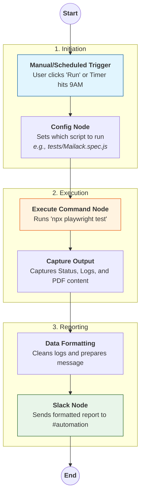

# 🤖 QA Automation Workflow: Playwright + n8n + Slack

This document serves as the official guide for the **Automation Workflow** designed for the QA team. It explains the "Why", the "How", and the "What" of our automated testing pipeline.

---

## 🌟 1. What is n8n?

**n8n** (Node-based No-code/Low-code) is a powerful workflow automation tool. Unlike traditional CI/CD tools that can be complex to configure, n8n uses a **visual node-based interface** to connect different services (like Playwright, Slack, Email, and Databases).

Think of n8n as the **orchestrator** or "Brain" that tells our tests when to run and where to send the results.

---

## ⚖️ 2. Why are we choosing n8n for this workflow?

We chose n8n for several critical reasons:

1.  **Visual Transparency**: Anyone on the team can open the n8n interface and see exactly how the data flows from the trigger to the final Slack notification.
2.  **Low-Code Flexibility**: It allows us to combine the power of **Playwright** (for complex web automation) with the ease of n8n's integrations (for Slack notifications, scheduling, and error handling).
3.  **Local Execution**: n8n runs directly on our environment, giving it full access to our local files, terminal, and security context.
4.  **Infinite Scalability**: We can easily add steps like "Send Email on Failure," "Log to Google Sheets," or "Trigger via Webhook" without writing a single line of extra infrastructure code.

---

## 🔄 3. The Automation Flow

The following diagram illustrates the flow of our automation from start to finish. This ensures that even someone new to the project can understand the logic in seconds.



---

## 🛠️ 4. Step-by-Step Process Document

Follow these steps to set up or run the workflow from scratch.

### Step 1: Prepare the Environment
Ensure you have the following installed on your machine:
- **Node.js** (v18+)
- **n8n** (Install globally via `npm install n8n -g`)
- **Project folder** checked out from Git.

```powershell
# Navigate to project
cd "Automation Workflow"

# Install Playwright dependencies
npm install
npx playwright install
```

### Step 2: Launch n8n
We have provided a helper script to start n8n automatically.
1. Right-click `start_n8n.ps1` and select **Run with PowerShell**.
2. Open your browser to: `http://localhost:5678`.

### Step 3: Import the Workflow
1. In the n8n dashboard, click **Workflows** > **Add Workflow**.
2. Click the three dots (top right) > **Import from File**.
3. Select `n8n-final-fix.json` from the project directory.

### Step 4: Configure Slack (One-Time Setup)
1. Double-click the **Slack Notification** node.
2. Under **Credential for Slack API**, select "Create New".
3. Enter your **Bot User OAuth Token** (ask your lead for the token starting with `xoxb-`).
4. Set the **Channel** to `#automation-results`.

### Step 5: Execute the Test
1. Double-click the **"Set Script to Run"** node.
2. Update the `ScriptPath` value if you want to run a specific test (e.g., `tests/Mailack.spec.js`).
3. Click **Execute Workflow** at the bottom of the screen.
4. Check your Slack channel for the results!

---

## 📖 5. Deep Dive: What the Test Script Does
*Example: `Mailack.spec.js`*

This script is the core of our "Internal Enquiry" automation. It performs the following complex actions:
1.  **Login**: Securely authenticates with the QA portal.
2.  **Navigation**: Expands the sidebar and navigates to **Internal Enquiry**.
3.  **Selection**: Selects the first available **"Pending"** entry.
4.  **Preview**: Clicks the **Send/Resend** button.
5.  **PDF Intelligence**: 
    - It detects the generated PDF within an iframe.
    - It downloads the raw PDF data.
    - It **parses the text content** of the PDF to verify accuracy.
6.  **Confirmation**: Clicks the final confirmation button and verifies the **Success Toast Message**.
7.  **Evidence**: Captures a screenshot automatically if any error occurs.

---

## 🆘 6. Troubleshooting

| If you see... | Change this... |
| :--- | :--- |
| **"npx" not found** | Update the Execute Command node to use the full path of npx.exe. |
| **Slack Error 400** | The log output is too long. The workflow automatically truncates it to 3800 chars. |
| **Empty Results** | Check if your "Working Directory" in n8n is set to the correct absolute path. |

---
*Documented by Antigravity AI*
