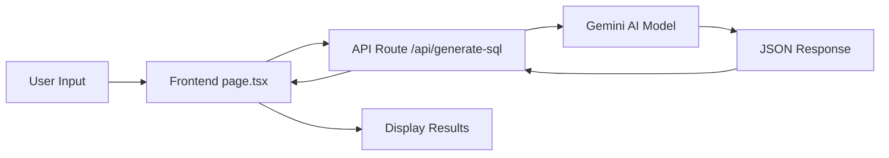

# SQL AI Architect - Complete Documentation

## Table of Contents
1. [Overview](#overview)
2. [Features](#features)
3. [Technology Stack](#technology-stack)
4. [Installation & Setup](#installation--setup)
5. [API Documentation](#api-documentation)
6. [Usage Guide](#usage-guide)
7. [Architecture](#architecture)
8. [Customization](#customization)
9. [Troubleshooting](#troubleshooting)

---

## Overview

**SQL AI Architect** is an intelligent SQL query generation tool powered by Google's Gemini 1.5 Flash AI model. It converts natural language descriptions into optimized SQL queries and provides detailed explanations of how each query works.

### Key Capabilities
- **Natural Language to SQL**: Describe what you need in plain English, get production-ready SQL
- **Schema-Aware**: Analyzes your database schema to generate accurate queries
- **Auto-Generate Examples**: Automatically creates diverse query examples (SELECT, JOIN, UPDATE, DELETE, etc.)
- **AI Explanations**: Every query comes with a clear explanation of its logic
- **Modern UI**: Premium Titanium Gray theme with smooth animations

---

## Features

### 1. Specific Query Generation
- Input your database schema (DDL)
- Ask questions in natural language
- Receive optimized SQL queries with explanations

### 2. Auto-Generate Examples
- Click "Auto-Generate Examples" button
- AI analyzes your schema
- Returns 5-7 diverse queries covering:
  - Simple SELECT statements
  - Aggregate functions (COUNT, SUM, AVG)
  - JOIN operations
  - UPDATE statements
  - DELETE operations
  - Complex filtering

### 3. Interactive UI
- **Schema Panel**: Left side for DDL input
- **Query Panel**: Right side for prompts and results
- **Copy to Clipboard**: One-click copy for generated SQL
- **Responsive Design**: Works on desktop and tablet

---

## Technology Stack

### Frontend
- **Framework**: Next.js 15.1.3 (React 19)
- **Styling**: Tailwind CSS v4
- **Animations**: Framer Motion
- **Icons**: Lucide React
- **Language**: TypeScript

### Backend
- **Runtime**: Node.js
- **API Routes**: Next.js API Routes
- **AI Model**: Google Gemini 1.5 Flash (`gemini-flash-latest`)
- **SDK**: `@google/generative-ai`

### Development
- **Package Manager**: npm
- **Dev Server**: Next.js Dev Server (Port 3000)
- **Build Tool**: Next.js Compiler

---

## Installation & Setup

### Prerequisites
- Node.js 18.x or higher
- npm or yarn
- Google Gemini API Key ([Get one here](https://aistudio.google.com/app/apikey))

### Step 1: Clone/Navigate to Project
```bash
cd "c:\Users\veera\.gemini\antigravity\AI model\SQL AI\sql-ai-app"
```

### Step 2: Install Dependencies
```bash
npm install
```

### Step 3: Configure Environment Variables
Create a `.env.local` file in the root directory:

```env
GEMINI_API_KEY=your_actual_api_key_here
```

**Important**: Replace `your_actual_api_key_here` with your actual Gemini API key.

### Step 4: Run Development Server
```bash
npm run dev
```

The application will be available at `http://localhost:3000`

### Step 5: Build for Production (Optional)
```bash
npm run build
npm start
```

---

## API Documentation

### Endpoint: `/api/generate-sql`

**Method**: `POST`

**Content-Type**: `application/json`

### Request Body

```typescript
{
  schema: string;      // Database schema in DDL format
  prompt: string;      // User's natural language question
  action: "specific" | "auto-generate";  // Mode of operation
}
```

### Request Examples

#### 1. Specific Query Generation
```json
{
  "schema": "CREATE TABLE Users (user_id INT PRIMARY KEY, username VARCHAR(50), email VARCHAR(100));",
  "prompt": "Show me all users who signed up in 2024",
  "action": "specific"
}
```

#### 2. Auto-Generate Examples
```json
{
  "schema": "CREATE TABLE Users (user_id INT PRIMARY KEY, username VARCHAR(50), email VARCHAR(100));",
  "prompt": "Generate examples",
  "action": "auto-generate"
}
```

### Response Format

#### For `action: "specific"`
```json
{
  "sql": "SELECT * FROM Users WHERE YEAR(created_at) = 2024;",
  "explanation": "This query selects all columns from the Users table where the year of the created_at timestamp is 2024."
}
```

#### For `action: "auto-generate"`
```json
{
  "results": [
    {
      "type": "SELECT",
      "sql": "SELECT * FROM Users;",
      "explanation": "Retrieves all user records from the database."
    },
    {
      "type": "JOIN",
      "sql": "SELECT u.username, o.total_amount FROM Users u JOIN Orders o ON u.user_id = o.user_id;",
      "explanation": "Joins Users and Orders tables to show usernames with their order amounts."
    }
    // ... 3-5 more examples
  ]
}
```

### Error Response
```json
{
  "error": "GEMINI_API_KEY is not configured on the server."
}
```

**Status Codes**:
- `200`: Success
- `500`: Server error (missing API key, Gemini API failure)

---

## Usage Guide

### Basic Workflow

1. **Enter Your Schema**
   - Paste your database DDL in the left panel
   - Example:
     ```sql
     CREATE TABLE Users (
         user_id INT PRIMARY KEY,
         username VARCHAR(50),
         email VARCHAR(100),
         created_at TIMESTAMP
     );
     ```

2. **Ask a Question**
   - Type your request in plain English
   - Examples:
     - "Show me all users created in the last 30 days"
     - "Calculate the total revenue by product category"
     - "Find users who haven't placed an order"

3. **Generate Query**
   - Press Enter or click "Generate"
   - View the SQL and explanation

4. **Copy & Use**
   - Click "Copy SQL" button
   - Paste into your database client

### Auto-Generate Mode

1. Enter your schema
2. Click "Auto-Generate Examples"
3. Review 5-7 diverse query examples
4. Each example includes:
   - Query type badge (SELECT, JOIN, UPDATE, etc.)
   - SQL code
   - Explanation

---

## Architecture

### Project Structure
```
sql-ai-app/
├── app/
│   ├── api/
│   │   └── generate-sql/
│   │       └── route.ts          # API endpoint
│   ├── globals.css               # Global styles & theme
│   ├── layout.tsx                # Root layout
│   └── page.tsx                  # Main UI component
├── public/                       # Static assets
├── .env.local                    # Environment variables (gitignored)
├── .env.example                  # Example env file
├── package.json                  # Dependencies
├── tailwind.config.ts            # Tailwind configuration
├── tsconfig.json                 # TypeScript config
└── DOCUMENTATION.md              # This file
```

### Data Flow



### Component Breakdown

#### Frontend (`app/page.tsx`)
- **State Management**: React hooks for schema, prompt, results, loading
- **API Communication**: Fetch API to backend
- **UI Rendering**: Framer Motion animations, Lucide icons
- **Modes**: Handles both "specific" and "auto-generate" actions

#### Backend (`app/api/generate-sql/route.ts`)
- **Request Validation**: Checks for API key
- **Prompt Engineering**: Different system prompts for each mode
- **AI Integration**: Calls Gemini API
- **Response Parsing**: Cleans and normalizes JSON output

---

## Customization

### Changing the Theme

The current theme is "Titanium Gray". To modify:

**File**: `app/globals.css`

```css
/* Change background gradient */
body {
  background: radial-gradient(circle at top left, #3f3f46, transparent 40%),
    radial-gradient(circle at bottom right, #18181b, transparent 40%),
    radial-gradient(circle at center, #09090b, #000000);
}
```

**File**: `app/page.tsx`

Update color classes:
- `bg-zinc-*` → Your color
- `text-zinc-*` → Your color
- `border-zinc-*` → Your color

### Adding New Query Types

**File**: `app/api/generate-sql/route.ts`

Modify the auto-generate prompt:
```typescript
systemPrompt = `...
Generate queries covering: SELECT, JOIN, UPDATE, DELETE, INSERT, SUBQUERY, WINDOW FUNCTIONS
...`;
```

### Adjusting AI Behavior

**Temperature & Creativity**: Modify the Gemini model configuration:
```typescript
const model = genAI.getGenerativeModel({ 
  model: "gemini-flash-latest",
  generationConfig: {
    temperature: 0.7,  // 0.0 = deterministic, 1.0 = creative
    maxOutputTokens: 2048,
  }
});
```

---

## Troubleshooting

### Issue: "GEMINI_API_KEY is not configured"
**Solution**: 
1. Check `.env.local` exists in root directory
2. Verify the key is correct (no quotes, no spaces)
3. Restart the dev server: `npm run dev`

### Issue: "429 Too Many Requests"
**Solution**: 
- You've exceeded the Gemini API rate limit
- Wait a few minutes
- Consider upgrading your API plan

### Issue: Scrollbar not visible
**Solution**: 
- The scrollbar is styled to be subtle
- It appears on hover
- Check `globals.css` for `::-webkit-scrollbar` styles

### Issue: Queries are inaccurate
**Solution**: 
1. Ensure your schema is complete and accurate
2. Be more specific in your natural language prompt
3. Include table relationships (FOREIGN KEY) in schema
4. Try rephrasing your question

### Issue: Build fails
**Solution**: 
```bash
# Clear cache and reinstall
rm -rf .next node_modules
npm install
npm run build
```

---

## API Rate Limits & Costs

### Gemini 1.5 Flash (Free Tier)
- **Rate Limit**: 15 requests per minute
- **Daily Quota**: 1,500 requests per day
- **Cost**: Free

### Gemini 1.5 Flash (Paid Tier)
- **Rate Limit**: Higher (varies by plan)
- **Pricing**: ~$0.00001 per 1K characters
- **Details**: [Google AI Pricing](https://ai.google.dev/pricing)

---

## Security Best Practices

1. **Never commit `.env.local`** - Already in `.gitignore`
2. **Use environment variables** - Never hardcode API keys
3. **Validate user input** - Sanitize schema and prompts
4. **Rate limiting** - Implement on production
5. **HTTPS only** - Use SSL in production

---

## Future Enhancements

- [ ] Query history/saved queries
- [ ] Export queries to file
- [ ] Multiple database dialect support (PostgreSQL, MySQL, SQLite)
- [ ] Schema visualization
- [ ] Query execution (with user's DB connection)
- [ ] Collaborative features (share queries)
- [ ] Dark/Light theme toggle

---

## Support & Resources

- **Gemini API Docs**: https://ai.google.dev/docs
- **Next.js Docs**: https://nextjs.org/docs
- **Tailwind CSS**: https://tailwindcss.com/docs
- **Framer Motion**: https://www.framer.com/motion/

---

## License

This project is for educational and internal use.

---

**Last Updated**: December 28, 2024  
**Version**: 1.0.0
