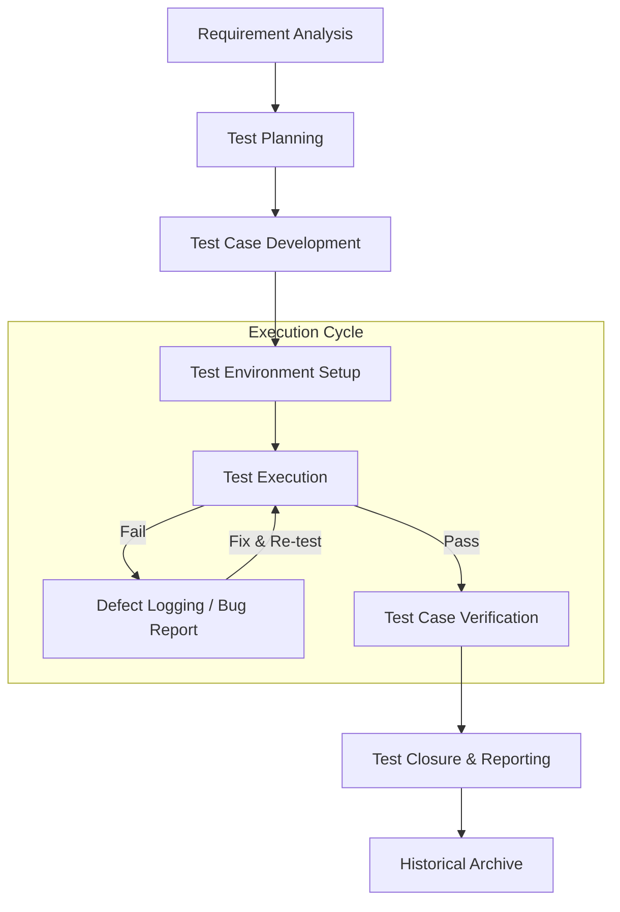

# 📋 Standard Test Management Workflow: Step-by-Step Guide

This document outlines a traditional, industry-standard **Test Management Workflow** (STLC - Software Testing Life Cycle). This process ensures quality and consistency across software releases without the use of AI.

---

## 🗺️ Standard Workflow Diagram

---

## 🚀 Step-by-Step Implementation Guide

### Step 1: Requirement Analysis
*   **Goal:** Understand what needs to be tested.
*   **Action:** Review the Product Requirement Document (PRD) or User Stories. Identify "Testable" requirements.
*   **Traceability:** Map each requirement to a unique ID (e.g., REQ-01) so you can later prove it was tested.

### Step 2: Test Planning
*   **Goal:** Define the strategy.
*   **Action:** Create a Test Plan document specifying:
    *   **Scope:** What is in and out of testing.
    *   **Resources:** Who is testing?
    *   **Tools:** Which tools are we using (e.g., Jira, TestRail, Playwright)?
    *   **Schedule:** Milestone dates for completion.

### Step 3: Test Case Development
*   **Goal:** Create the detailed "How-To" for testing.
*   **Action:** Write test cases including:
    1.  **Pre-conditions:** What state should the app be in?
    2.  **Steps:** Exact clicks and inputs required.
    3.  **Expected Result:** What *should* happen.
    4.  **Priority:** High, Medium, or Low.

### Step 4: Environment Setup
*   **Goal:** Prepare the laboratory.
*   **Action:** Configure the hardware, software, and data.
    *   Ensure the "QA Environment" is separate from "Production."
    *   Initialize test data (e.g., standard test user accounts).

### Step 5: Test Execution
*   **Goal:** Run the tests and record results.
*   **Action:** 
    *   Perform the manual steps or trigger automation scripts (Playwright/Selenium).
    *   **Status Update:** Mark cases as **Passed**, **Failed**, **Blocked**, or **Skipped**.

### Step 6: Defect Management (Bug Tracking)
*   **Goal:** Fix discovered issues.
*   **Action:** If a test fails:
    1.  Log a **Bug Report** with screenshots and logs.
    2.  Assign to a developer.
    3.  Once fixed, **Re-test** to confirm the fix works.
    4.  Perform **Regression Testing** to ensure the fix didn't break anything else.

### Step 7: Test Closure & Reporting
*   **Goal:** Final evaluation.
*   **Action:** Generate a **Test Summary Report (TSR)**.
    *   Percentage of passed vs. failed cases.
    *   Total number of open bugs.
    *   "Go/No-Go" recommendation for the release.

---

## 🏗️ Common Tools Used
| Category | Popular Tools |
| :--- | :--- |
| **Management** | Jira + Xray, TestRail, Zephyr, Azure DevOps |
| **Automation** | Playwright, Selenium, Cypress, Appium |
| **Defect Tracking** | Bugzilla, Jira, Mantis |
| **Reporting** | PowerBI, Excel, Allure Reports |

---

## 💡 Best Practices
*   **Early Involvement:** Testers should review requirements *before* development starts.
*   **Maintenance:** Regularly update test cases as the product features change.
*   **Documentation:** Always attach proof (logs/screenshots) to failed test results.

---
*Standard Software Quality Assurance Process*
